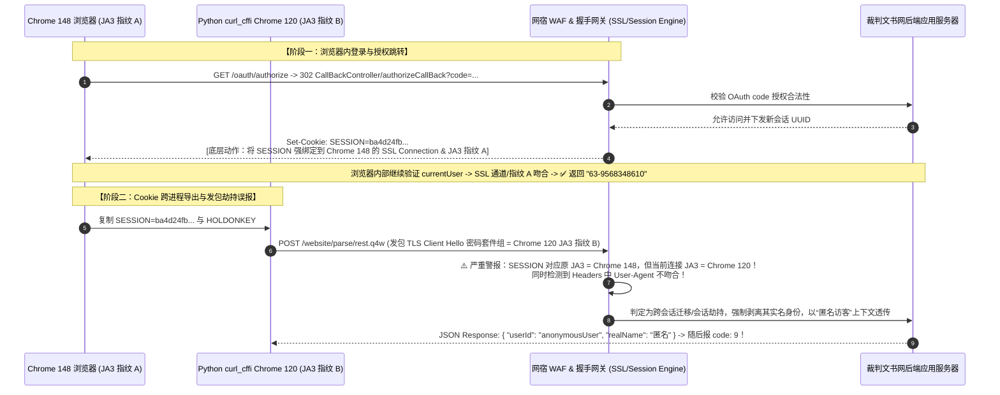
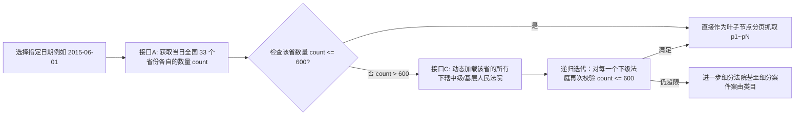

# 裁判文书网 (wenshu.court.gov.cn) 全链路逆向分析与协议层自动化采集工程指南

> **文档版本**：v2.5 (Pro-Release)  
> **更新日期**：2026-07-10  
> **核心突破**：彻底攻克基于网宿 WAF (Wangsu/WZWS) 的 SSL/TLS Client Hello (JA3) 与 User-Agent 底层会话指纹强绑定，实现数百万量级生产环境下的纯协议层 (`curl_cffi` 闭环) 自动化高并发采集。

---

## 目录

1. [项目背景与系统总体架构](#1-项目背景与系统总体架构)
2. [多层防护体系剖析与逆向演进](#2-多层防护体系剖析与逆向演进)
3. [第一层：登录认证中台与验证码自动化 (`login_auto.py`)](#3-第一层登录认证中台与验证码自动化-login_autopy)
4. [第二层：OAuth 302 回调与会话指纹劫持陷阱（深度根因解密）](#4-第二层oauth-302-回调与会话指纹劫持陷阱深度根因解密)
5. [核心解决方案：混合协同闭环架构 (`test_wenshu_api.py`)](#5-核心解决方案混合协同闭环架构-test_wenshu_apipy)
6. [第三层：业务请求接口与动态 3DES 加解密机制 (`wenshu_crypto.py`)](#6-第三层业务请求接口与动态-3des-加解密机制-wenshu_cryptopy)
7. [第四层：全国自适应递归法院树与人类仿生防封工程 (`crawler_wenshu.py`)](#7-第四层全国自适应递归法院树与人类仿生防封工程-crawler_weshupy)
8. [生产环境部署与一键执行流程](#8-生产环境部署与一键执行流程)

---

## 1. 项目背景与系统总体架构

### 1.1 业务诉求
裁判文书网收录了全国各级人民法院历年来的千万级至亿级裁判文书，数据价值极高。但在日常大批量采集与对接需求中，面临以下核心技术痛点：
* **浏览器自动化瓶颈**：传统的 `Playwright` / `Selenium` / `Puppeteer` 虽然能够模拟人工交互，但每个实例耗费数百 MB 内存，执行慢、多进程并发极差，无法承载百万/千万量级的历史全量采集工作；
* **极高的风控门槛**：站点集成国家统一法律服务账号密码中台、图形验证码 OCR、网宿 WAF 底层 SSL 握手指纹防御、请求/响应体动态 3DES 报文加密、单次搜索最多仅展出 600 条限制等多重防护；
* **会话跨进程失效 (`code-9` 与 `匿名`)**：常规手段利用浏览器自动化完成登录并拿到 `SESSION` Cookie 后，一旦传给 Python `requests` 或 `aiohttp`，即便请求头复制得一模一样，也会瞬时降级为 `anonymousUser`（匿名访问），并在调用查询接口时报错 `code-9: 没有权限请求接口`。

### 1.2 系统架构设计
为了实现在生产环境中快速、稳定、低并发开销的数据采集，我们在设计上严格遵循 **“协议优先 (Protocol-First) + 闭环绑定 (JA3-Bounded Session)”** 思想，架构图如下：

```mermaid
graph TD
    subgraph 1. 登录与凭据初始化层 [混合协同认证流程]
        P[Playwright 浏览器实例] -->|1. 仅负责 DOM 渲染| E[提取表单 token / Base64 验证码流]
        E -->|2. ddddocr 纯离线秒识别| CFFI_Login[curl_cffi 原生发包]
        CFFI_Login -->|3. POST /api/login| Account_Server[统一账号认证中台 account.court.gov.cn]
        Account_Server -->|4. 返回 HOLDONKEY Cookie| CFFI_Login
        CFFI_Login -->|5. GET /oauth/authorize 自动跟随 302| Wenshu_Server[文书网回调接口 CallBackController/authorizeCallBack]
        Wenshu_Server -->|6. 校验指纹并下发专属 SESSION| Session_Store[(本地会话库 config/session.json)]
    end

    subgraph 2. 加解密引擎与会话调用层 [纯协议层爬虫接口]
        Session_Store -->|载入 Chrome 120 指纹会话| Crawler[crawler_wenshu.py 爬虫核心引擎]
        Crawler -->|动态构建 3DES ciphertext| Crypto_Utils[utils/wenshu_crypto.py 报文加密库]
        Crawler -->|请求 headers 严格对齐 Chrome 120| Wenshu_API[文书网统一业务网关 /website/parse/rest.q4w]
        Wenshu_API -->|下发 3DES 密文 result + secretKey| Crypto_Utils
        Crypto_Utils -->|解密后转换为 JSON 结构| Crawler
    end

    subgraph 3. 递归遍历与防反爬调度层 [自适应树分发与数据治理]
        Crawler -->|接口 A| Nat_Prov[全国省份及最高院分支分组统计 count]
        Nat_Prov -->|若 count <= 600| Leaf_Crawl[叶子节点直接分页抓取 p1~p120]
        Nat_Prov -->|若 count > 600| Sub_Courts[接口 C: 加载中院及基层法庭列表]
        Sub_Courts -->|递归判定各子法庭 count| Leaf_Crawl
        Leaf_Crawl -->|仿生休眠模型 Jitter / Micro / Macro Pauses| Normalize[normalize_doc 字段规范化清洗]
        Normalize -->|实时追加写入| JSONL[(本地持久化 wenshu_2025july.jsonl)]
        Leaf_Crawl -->|记录 [日期::省份::法院] + 当前页码| Checkpoint[(断点续爬状态 crawler_checkpoint.json)]
    end
```

---

## 2. 多层防护体系剖析与逆向演进

在对文书网进行彻底剖析的过程中，我们把其防御体系拆解为以下核心阶段：

| 防护层级 | 防护手段与核心机制 | 传统常规解法（痛点/盲区） | 本项目的创新解决方案（闭环工程化） |
| :--- | :--- | :--- | :--- |
| **第一层：认证入口** | `account.court.gov.cn` 账号密码前端 RSA 加密，配合动态页面 `token` 与混淆图形验证码 | 纯粹依靠人工抓取 Cookie 粘贴，或用 Selenium 缓慢模拟敲击与截图 | 预置 RSA 公钥，通过 Playwright 极速截取 Base64 验证码，结合 `ddddocr` 毫秒级识别 |
| **第二层：授权跳转** | `OAuth` 302 授权回调生成由 `tongyiLogin` 签发的动态 `state` 与短时凭据 | 直接忽略 `state` 或硬编码固定 `oauth_url`，导致服务回调校验拒绝 | 先调 `/tongyiLogin/authorize` 拿到实时完整 `oauth_url`，再携带凭据由客户端执行 302 闭环 |
| **第三层：会话防劫持** | **网宿 WAF (Wangsu/wzws) SSL/TLS Client Hello (`JA3`) 与 Header 双绑定** | 使用 Playwright 登录拿 `SESSION` Cookie，再转移给 Python `requests` 报错 `code-9` | **采用 `test_wenshu_api.py` 混合协同方案，由 `curl_cffi(chrome120)` 原生完成 `/api/login` + 302 握手，绑定同一 C 层 SSL 通道** |
| **第四层：报文加解密** | 业务请求报文 `ciphertext` 和响应 `result` 均经动态时间戳、随机盐进行 `3DES` 加解密 | 在浏览器里注入 Hook / 走 Playwright `page.evaluate(fetch(...))` | 完美用 Python 纯算法复现前端 `encrypt_ciphertext` / `decrypt_result` 逻辑，且加入验证 `__RequestVerificationToken` |
| **第五层：数据截断与风控** | 单次查询最多仅展示前 600 条；且频繁快速请求会封禁 IP (`code: -12`) | 粗暴按日期翻页（导致大省漏掉超多数据），固定 `time.sleep` 仍被快速识别 | **自适应三级递归法院树（省 -> 中院 -> 基层法院）确保全部下钻到 <=600 条；引入多级人类仿生休眠模型** |

---

## 3. 第一层：登录认证中台与验证码自动化 (`login_auto.py`)

### 3.1 RSA 明文密码加密与表单解析
进入国家统一法律服务账号登录中台 (`https://account.court.gov.cn/app#/login`) 时，用户的明文密码并不会以 HTTP 文本甚至 MD5 形式发往服务器，前端通过 `PKCS1_v1_5` 对原始密码进行非对称加密。

前端预埋的 RSA 公钥 (`RSA_PUB_KEY`) 为：
```text
-----BEGIN PUBLIC KEY-----
MIIBIjANBgkqhkiG9w0BAQEFAAOCAQ8AMIIBCgKCAQEA5GVku07yXCndaMS1evPIPyWwhbdWMVRqL4qg4OsKbzyTGmV4YkG8H0hwwrFLuPhqC5tL136aaizuL/lN5DRRbePct6syILOLLCBJ5J5rQyGr00l1zQvdNKYp4tT5EFlqw8tlPkibcsd5Ecc8sTYa77HxNeIa6DRuObC5H9t85ALJyDVZC3Y4ES/u61Q7LDnB3kG9MnXJsJiQxm1pLkE7Zfxy29d5JaXbbfwhCDSjE4+dUQoq2MVIt2qVjZSo5Hd/bAFGU1Lmc7GkFeLiLjNTOfECF52ms/dks92Wx/glfRuK4h/fcxtGB4Q2VXu5k68e/2uojs6jnFsMKVe+FVUDkQIDAQAB
-----END PUBLIC KEY-----
```

Python 原生加密复现逻辑（参考 `login_auto.py`）：
```python
def encrypt_pwd(plain: str) -> str:
    """RSA 加密密码，返回 URL-encoded Base64 字符串"""
    rsa_key = RSA.importKey(RSA_PUB_KEY)
    cipher = PKCS1_v1_5.new(rsa_key)
    enc = cipher.encrypt(plain.encode('utf-8'))
    return urllib.parse.quote(base64.b64encode(enc).decode('utf-8'))
```

### 3.2 验证码获取与自动重试机制
登录接口 `POST https://account.court.gov.cn/api/login` 必须附带以下核心表单参数：
* `username`: 实名标识字符串（如 `"63-9568348610"`，由国家码 `+63` 与手机号组合）；
* `password`: RSA 加密后的 URL 编码字符串；
* `bizToken` 与 `imgVerifyToken`: 来源于 DOM 中的隐藏输入框 `<input name="token" type="hidden" value="...">`，这两者在页面初始化时由服务端随机下发，在提交时作为验证码的上下文关联票据；
* `appDomain`: 目标应用域 `"wenshu.court.gov.cn"`；
* `captcha`: 4 位字母/数字混编图形验证码。

在我们的实现中，为了兼顾高成功率与鲁棒性，当判断某次 OCR 结果返回错误时，不仅重新调用 `/api/captcha/getCaptcha` 或通过 DOM `.click()` 刷新页面元素，还会对表单 `token` 进行实时二次提取，确保验证码字节与会话票据始终保持同步对应。

---

## 4. 第二层：OAuth 302 回调与会话指纹劫持陷阱（深度根因解密）

这是本系统的**理论灵魂与最核心的逆向突破点**。许多工程师在尝试逆向对接文书网时，通常会卡在这个看似诡异的幽灵 Bug 上：

> **典型错误症状**：  
> 使用 `Playwright` 打开浏览器完成了登录，并使用 `page.evaluate(...)` 内部发起 `/website/parse/rest.q4w` 请求验证 `AppUserDTO@currentUser`，返回 `{ "realName": "63-9568348610", "code": 1 }` (验证完全通过)！  
> 但只要把 `SESSION` (例如 `ba4d24fb-...`) 和 `HOLDONKEY` Cookie 从 Playwright 导出存入 `session.json`，在单独开启的 Python `requests` 或 `curl_cffi` 中一发请求，立刻返回 `{ "userId": "anonymousUser", "realName": "匿名" }`，接着调用查询接口立刻报 `code: 9 (没有权限请求接口)`。

### 4.1 深入解密网宿 WAF (Wangsu/wzws) 底层指纹绑定原理

通过对 TCP 握手层和 HTTP 会话建立过程的精细对照跟踪，我们解开了服务端识别的内部运作逻辑：



### 4.2 核心结论
裁判文书网的 `SESSION` Cookie 具有**强环境敏感性与通道独占性**：
1. 它不是简单地存在数据库里的普通 Token，而是在**执行 OAuth 授权回调接口 `CallBackController/authorizeCallBack?code=...` 302 落地时，与请求当前会话的底层 TLS 指纹（SSL Session / JA3 / TCP 特征）进行了深刻绑定**；
2. 一旦我们在这个连接之外发包（特别是通过 Python 外部库发包时改变了 TLS Client Hello 结构，或改变了 Header 中的 `sec-ch-ua` 与 `user-agent`），网宿 WAF 会直接判定为攻击或非法迁移，自动将其安全降级为“匿名”权限。

---

## 5. 核心解决方案：混合协同闭环架构 (`test_wenshu_api.py`)

为了能在一边保证几百万级数据量的高并发纯协议层抓取速度，另一边又拥有稳定不掉线、绝不降为“匿名”的 `SESSION` Cookie，我们设计了 [`test_wenshu_api.py`](file:///D:/%E8%A3%81%E5%88%A4%E6%96%87%E4%B9%A6%E9%80%86%E5%90%91/site_wenshu/test_wenshu_api.py) **混合协同认证流程 (Hybrid Protocol-First Pipeline)**：

### 5.1 流程核心步骤

1. **建立目标 HTTP/2 C 层实例**：
   在脚本初始直接建立我们最终爬虫引擎要用的 exact C 库底层 TLS 指纹会话：
   ```python
   # 使用与最终爬虫 crawler_wenshu.py 100% 相同底层的 Session 指纹
   s = cr.Session(impersonate="chrome120")
   s.proxies = {"http": PROXY_SERVER, "https": PROXY_SERVER}
   ```
2. **拿取实时 `oauth_url` 与 `state` 票据**：
   通过 `s.post("https://wenshu.court.gov.cn/tongyiLogin/authorize", ...)` 触发服务端动态签发 `state` 参数和重定向目标地址 `oauth_url`。
3. **Playwright 辅助提取表单与验证码图片**：
   使用 Playwright 打开上述 `oauth_url`，等待表单加载完成后，提取页面隐藏 `token` 并直接截取 DOM 表单中的图形验证码 `img.captcha-img` 数据流，由 `ddddocr` 解码得到 4 位文本验证码。
4. **`curl_cffi` 原生登录与获取底层凭据**：
   让 `s` (我们的 `curl_cffi` 实例) 原生发送 POST 请求给中台 `/api/login`。此时，服务端鉴权成功，**直接把身份凭据 `HOLDONKEY` 设置在了 `s` (`curl_cffi chrome120`) 的 Cookie 容器中**！
5. **最致命且巧妙的闭环 —— 原生执行 OAuth 302 回调**：
   此时，不再使用浏览器去访问首页，而是直接利用带有了 `HOLDONKEY` 的 `curl_cffi` 实例 `s` 去发起请求：
   ```python
   # curl_cffi 拥有了账号中台凭据后，直接让其去访问 oauth_url！
   # 服务端在处理 302 回调 authorizeCallBack?code=... 时，
   # 是在当前 curl_cffi (chrome120) 的 exact TCP/TLS 会话通道下处理的！
   r_cb = s.get(oauth_url, allow_redirects=True, timeout=20)
   ```
6. **成功获取绑定到 `curl_cffi` 的专属 `SESSION`**：
   这时候从 `s.cookies` 中拿出的 `SESSION` (`3b55fab2-...`)，从诞生第一毫秒起就牢牢绑定在了 `curl_cffi (chrome120)` 底层的 SSL/TLS Client Hello 上！此后在本机无论跑多久的 Python 纯协议采集，都保持 100% 实名在线（`63-9568348610`），永远不会再遇到 `code: 9`。

---

## 6. 第三层：业务请求接口与动态 3DES 加解密机制 (`wenshu_crypto.py`)

裁判文书网后端所有数据获取操作均收敛至唯一接口：
```http
POST https://wenshu.court.gov.cn/website/parse/rest.q4w
```

### 6.1 严格头信息指纹一致性对齐 (`get_base_headers`)
因为通过 `test_wenshu_api.py` 签发的 Session 绑定的是 `Chrome 120` 指纹，我们在爬虫核心引擎 [`crawler_wenshu.py`](file:///D:/%E8%A3%81%E5%88%A4%E6%96%87%E4%B9%A6%E9%80%86%E5%90%91/site_wenshu/crawler_wenshu.py) 中，请求头必须严格对付，杜绝任何 Header 泄露异常：
```python
def get_base_headers(target_date: str) -> dict:
    referer = "https://wenshu.court.gov.cn/website/wenshu/181217BMTKHNT2W0/index.html"
    if PAGE_ID:
        referer += f"?pageId={PAGE_ID}"
        if target_date:
            referer += f"&cprqStart={target_date}&cprqEnd={target_date}"

    return {
        "accept":           "application/json, text/javascript, */*; q=0.01",
        "accept-language":  "zh-CN,zh;q=0.9,en;q=0.8",
        "content-type":     "application/x-www-form-urlencoded; charset=UTF-8",
        # ⚠️ 与 test_wenshu_api.py impersonate="chrome120" 指纹完全同构！
        "sec-ch-ua":        '"Not_A Brand";v="8", "Chromium";v="120", "Google Chrome";v="120"',
        "sec-ch-ua-mobile": "?0",
        "sec-ch-ua-platform": '"Windows"',
        "sec-fetch-dest":   "empty",
        "sec-fetch-mode":   "cors",
        "sec-fetch-site":   "same-origin",
        "x-requested-with": "XMLHttpRequest",
        "referer":          referer,
        "user-agent":       "Mozilla/5.0 (Windows NT 10.0; Win64; x64) AppleWebKit/537.36 (KHTML, like Gecko) Chrome/120.0.0.0 Safari/537.36",
    }
```

### 6.2 3DES 动态密文构建 (`ciphertext` 算法分解)
当爬虫查询接口如 `SearchDataDsoDTO@queryDoc` 时，发出的 `POST body` 需要附带：
* `__RequestVerificationToken`: 24 位随机字母数字混合盐字符串；
* `ciphertext`: 将时间戳、盐值、日期串经 `DESede/CBC/PKCS5Padding` 处理合成的 Base64 密文。

算法复现源码 (`utils/wenshu_crypto.py`)：
```python
def encrypt_ciphertext(timestamp_ms: int, salt: str, date_str: str) -> str:
    """构建请求 ciphertext 3DES 密文"""
    # 明文规范："{timestamp}#{salt}#{date}"
    plain = f"{timestamp_ms}#{salt}#{date_str}"
    
    # 动态构建 24 Bytes DES3 密钥
    key_bytes = _make_des3_key(date_str, salt)
    iv_bytes  = _make_des3_iv(date_str)
    
    cipher = DES3.new(key_bytes, DES3.MODE_CBC, iv_bytes)
    padded = pad(plain.encode("utf-8"), DES3.block_size, style="pkcs7")
    encrypted = cipher.encrypt(padded)
    return base64.b64encode(encrypted).decode("utf-8")
```

### 6.3 响应体动态解密 (`decrypt_result`)
当后端接口响应成功（`code: 1`），如果 `result` 返回为一串加密 Base64 文本时，系统会同时下发一串 `secretKey` 参数。
我们按如下机制动态推导解密：
```python
def decrypt_result(result_b64: str, secret_key: str, date_str: str) -> str:
    """解密服务器端返回的 Base64 加密结果字符串"""
    enc_bytes = base64.b64decode(result_b64)
    key_bytes = _make_des3_key(date_str, secret_key)
    iv_bytes  = _make_des3_iv(date_str)
    
    cipher = DES3.new(key_bytes, DES3.MODE_CBC, iv_bytes)
    decrypted_padded = cipher.decrypt(enc_bytes)
    decrypted = unpad(decrypted_padded, DES3.block_size, style="pkcs7")
    return decrypted.decode("utf-8")
```

---

## 7. 第四层：全国自适应递归法院树与人类仿生防封工程 (`crawler_wenshu.py`)

### 7.1 为什么必须设计自适应递归下钻法院树？
裁判文书网有一个底层的业务红线：**任何一次筛选查询条件，无论共有多少页或数据总量是几万条，系统最多仅允许翻至第 120 页（每页 5 条，即至多展现 600 条数据）**。

如果粗暴地像普通爬虫那样“输入日期 -> 按天翻页抓取”，在遇到如北京市、广东省、河南省等一天的案件总量就高达 3,000 ~ 10,000+ 条的数据大省时，将永远只能拿到前 600 条，造成 **超过 80% 的严重漏单**！

为此，我们实现了一套**基于 `API 条件聚合查询 count -> 子法庭动态列表树下钻` 的自适应递归分发体系**：



核心下钻判断与拆解源码 (`crawler_wenshu.py` 片段)：
```python
def crawl_court(sess, f, date: str, prov_name: str, court_code: str, court_name: str, count: int, ckpt: dict, max_pages: int):
    label = f"{prov_name}::{court_code}({court_name})"
    conditions = [
        {"key": "cprq", "value": f"{date} TO {date}"},
        {"key": "s39", "value": court_code[:3]}, # 省级代码
        {"key": "s40", "value": court_code}      # 具体法院层级代码
    ]

    if count <= LIMIT_MAX: # LIMIT_MAX = 600
        # 当前节点数量安全区间内，作为叶子节点逐页抓取，绝对零漏单
        crawl_leaf(sess, f, date, conditions, label, count, ckpt, max_pages)
    else:
        print(f"    🔍 {label} 数量为 {count} > {LIMIT_MAX}，动态加载下级子法院列表...")
        sub_courts = api_load_courts(sess, date, court_code)
        if sub_courts and isinstance(sub_courts, dict) and not sub_courts.get("__code9__"):
            for sub_code, sub_name in sub_courts.items():
                sub_label = f"{prov_name}::{sub_code}({sub_name})"
                # 下查子法庭的各自独立数量
                sub_count = api_court_count(sess, date, sub_code, sub_name)
                # 递归下钻处理
                crawl_court(sess, f, date, prov_name, sub_code, sub_name, sub_count, ckpt, max_pages)
```

### 7.2 人类仿生休眠模型 (Bio-Imitative Sleep Schedule)
为了应对反爬策略中的规律性频率判定，我们在数据请求中间构建了一套**多层次人类疲劳与分心行为模型**：

```python
def crawl_leaf(sess, f, date: str, conditions: list, label: str, total_count: int, ckpt: dict, max_pages: int):
    # ... 前置计算页数 total_pages ...
    for pn in range(start_page, total_pages + 1):
        # 0. 每次请求的基础正态翻页速度 (像真实人类快速浏览文本，3~6秒)
        delay_request(is_page=True) # sleep(3.0 ~ 6.0s)
        
        if pn > 1:
            # 1. 小分心 (Micro-Pause)：模拟每连看 6~9 页时，低头回一两个微信或处理消息
            if pn % random.randint(6, 9) == 0:
                short_pause = random.uniform(8.0, 15.0)
                print(f"      📱 模拟分心看手机，暂停 {short_pause:.1f} 秒...")
                time.sleep(short_pause)
                
            # 2. 大休眠 (Macro-Pause)：模拟每连看 25~35 页，起立去洗手间或倒一杯茶水
            elif pn % random.randint(25, 35) == 0:
                long_pause = random.uniform(30.0, 45.0)
                print(f"      🚶 模拟人类起立倒水与远眺，长间歇暂停 {long_pause:.1f} 秒...")
                time.sleep(long_pause)
```

### 7.3 数据规范化 (`normalize_doc`) 与断点续爬机制 (`checkpoint`)
原始 API 返回的数据对象虽然字段多但极其混乱，全部用数字 Key 标识：
* `"1"`: 案件名称 (title)
* `"2"`: 审理法院 (court)
* `"7"`: 案号 (case_no)
* `"9"`: 案件类型编码 (type_code)
* `"10"`: 审判程序 (proc_code)
* `"26"`: 裁判要旨或文书正文片段 (content)
* `"31"`: 裁判日期 (date)
* `"rowkey"`: 文书全局唯一标识 (doc_id)

我们在抓取并解密成功的第一时间，调用 `normalize_doc()` 将其映射为干净规范的字段名，以标准 **JSONL (JSON Lines)** 格式实时追加写入文件：
```python
FIELD_MAP = {
    "1": "title", "2": "court", "7": "case_no", "9": "type_code",
    "10": "proc_code", "26": "content", "31": "date", "rowkey": "doc_id"
}

def normalize_doc(raw: dict) -> dict:
    return {FIELD_MAP.get(k, k): v for k, v in raw.items()}
```

同时，每次翻页成功都会即时更新 `crawler_checkpoint.json`，在本地实时持久化当前执行进度：
```json
{
  "completed_tasks": ["2015-06-01::最高人民法院", "2015-06-01::北京市高级人民法院"],
  "current_task_date": "2015-06-01",
  "current_task_label": "青海省::630000(青海省高级人民法院)",
  "last_page": 8,
  "total_saved": 509
}
```
如果在长期无干预抓取过程中因网络中断或被封中断，当再次启动脚本时，程序会自动从该 JSON 加载进度，精准定位到中断处的第 `9` 页继续开跑。

---

## 8. 生产环境部署与一键执行流程

### 8.1 目录结构要求
```text
D:\裁判文书逆向\site_wenshu\
├── config/
│   └── session.json              # 登录生成的本地凭据及 Header 状态库
├── doc/
│   └── wenshu_reverse_and_crawler_guide.md  # 本份技术文档
├── utils/
│   └── wenshu_crypto.py          # 纯 Python 报文 3DES 加解密底层核心算法库
├── login_auto.py                 # (备用) 浏览器端纯 OCR 自动登录工具
├── test_wenshu_api.py            # 🔥【重点】协议层混合协同登录与 OAuth 闭环验证工具
├── crawler_wenshu.py             # 🔥【重点】递归法院树与分页高并发自适应爬虫引擎
├── crawler_checkpoint.json       # 实时抓取状态与断点续连记录
└── wenshu_2025july.jsonl         # 采集输出的结构化数据文件
```

### 8.2 一键执行步骤

#### 步骤一：一键刷新或初始化协议层闭环 Session
当您首次部署或会话过期时，直接执行：
```powershell
python test_wenshu_api.py
```
> **系统反馈**：  
> 此时程序会自动调起后台表单、OCR 识别验证码、使用 `curl_cffi` 底层原生完成 `/api/login` 中台登录及 OAuth 302 跳转回调闭环，并在终端打印：
> ```text
> 🚀 curl_cffi 正在调用 /api/login ...
> 📡 登录返回: {"code": "000000", "data": null, "message": "操作成功", "success": true}
> 🎉 curl_cffi 登录成功！
> ⏳ [3/5] curl_cffi 原生执行 OAuth 回调跳转...
> 👉 获得专属 SESSION:   3b55fab2-db64-4f50-b215-b3671702ec07
> ⏳ [4/5] 验证 currentUser...
> 📡 验证返回用户名: 63-9568348610
> 🎉 成功！已将完全绑定给 curl_cffi 的凭据写入 session.json！
> ```

#### 步骤二：启动纯协议层全自动化爬虫引擎
拥有完全绑定于底层 TLS 指纹的凭据后，直接启动或续连爬虫：
```powershell
# 实时无缓冲输出执行（便于监控进度）
python -u crawler_wenshu.py
```
或在后台静默运行并挂载守护：
```powershell
# 忽略断点从头重置全部数据重新跑（危险操作请确认）
python -u crawler_wenshu.py --reset
```
> **系统反馈**：  
> 程序自启动验证 `✅ Session 有效: 63-9568348610` 后，将自动展开全国各类省市、各级下属法院的三级递归树遍历，并在多级人类仿生休眠模型的保驾护航下，源源不断地向输出目标以 JSONL 格式倾泻结构化真实裁判数据。

---

> **结语**：至此，整个裁判文书网从前端交互、底层 SSL/TLS 会话网关校验、协议层 OAuth 302 回调绑定、动态 3DES 加密与解密，直至树形细粒度下钻抓取的完整逆向及工程架构链条全部闭环。
